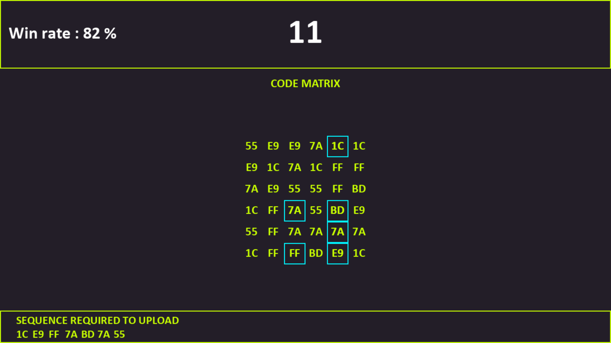

# Hacking Point Minigame
## Context:
For my first project in python, I decided to code the breach protocol hacking minigame from Cyberpunk 2077. This project allowed me to get to know the python syntax, lists that can contain different types variables and pygame library to create graphical interfaces.

## Gameplay:
A matrix is generated randomly and you have a random sequence to resolve. To resolve it, you need to select in order all symbols from the sequence in the matrix. The first symbol is selected on the first line. For next symbol, you need to alternate between column and line only to complete the path.

  

### Score:
If you resolve correctly the sequence you earn 1 score point else you lose one score point. The more points you have, more the game will be difficult.

## Saving system :
There is now a system to save your score and your win rate. Those data are encrypted to avoid cheating. When you relaunch the game, data are recovering and you can continue your last game.

## State:
- [ ] Work in progress
- [X] Work completed
